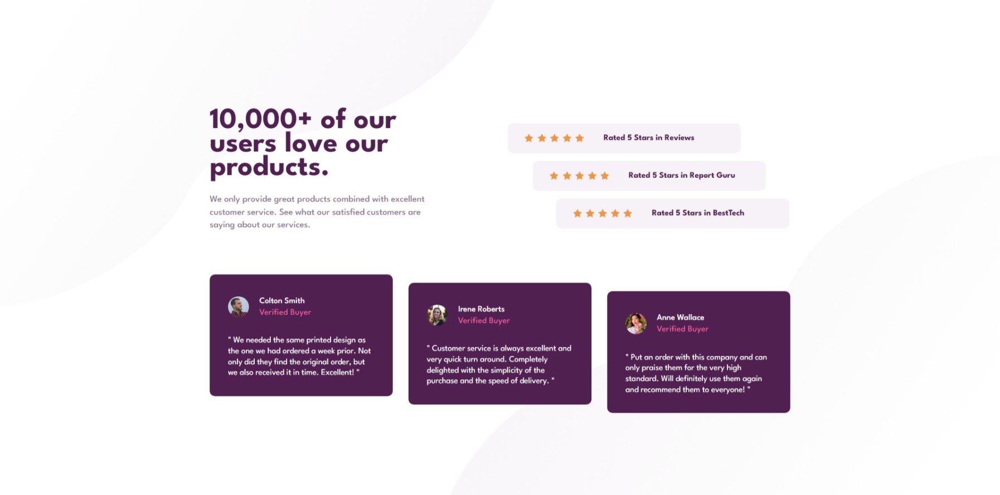

# Frontend Mentor - Social proof section solution

This is a solution to the [Social proof section challenge on Frontend Mentor](https://www.frontendmentor.io/challenges/social-proof-section-6e0qTv_bA). Frontend Mentor challenges help you improve your coding skills by building realistic projects. 

## Table of contents

- [Overview](#overview)
  - [Screenshot](#screenshot)
  - [Links](#links)
- [My process](#my-process)
  - [Built with](#built-with)
  - [Continued development](#continued-development)
  - [AI Collaboration](#ai-collaboration)
- [Author](#author)

### Screenshot

### Links

- Solution URL: [Frontend Mentor Solution](https://www.frontendmentor.io/solutions/social-proof-section-jtAqt08mm6)
- Live Site URL: [Social Proof Section Live Site Solution](https://osmond20.github.io/Social-proof-section/)

## My process

### Built with

- Semantic HTML5 markup
- CSS custom properties
- Flexbox
- CSS Grid
- Mobile-first workflow

### Continued development

Will be growing my ability to design responsive layouts for landing pages and more complex webpaeg requirements.

### AI Collaboration

Describe how you used AI tools (if any) during this project. This helps demonstrate your ability to work effectively with AI assistants.

- Github Copilot was used in solving the solution
- Github Copilot assisted me in figuring out how to get the background to placed in the way that it is placed, so that it si similar to the design image.

## Author

- Website - [Github](https://www.github.com/osmond20)
- Frontend Mentor - [@osmond20](https://www.frontendmentor.io/profile/osmond20)

